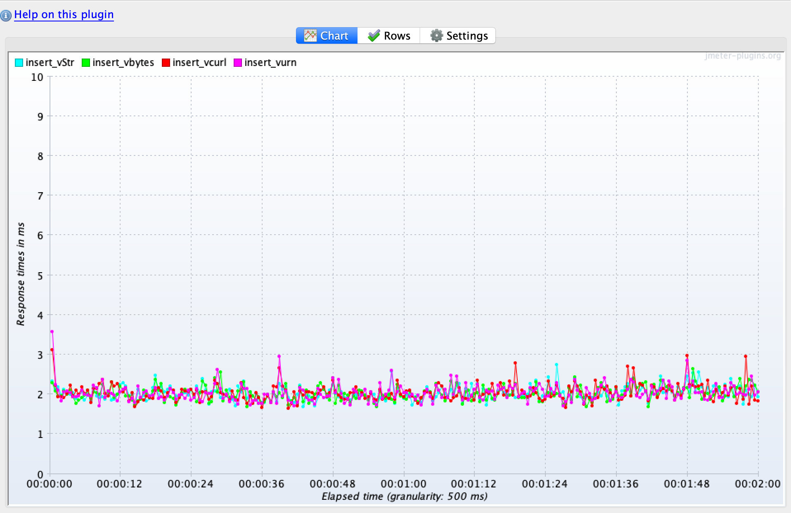

# Quick Test to show performance of UUID presentation layers
With CockroachDB, UUID can be presented as several different ways. 


**String format**
```
63616665-6630-3064-6465-616462656564
```

**Curly Brace format**
```
{63616665-6630-3064-6465-616462656564}
```

**Urn format:**
```
urn:uuid:63616665-6630-3064-6465-616462656564
```

**Byte format**
```
b'kafef00ddeadbeed'
```

## Test configuration

```sql
create database uuid;

use uuid;

create table vstr (
    token uuid
);

create table vcurl (
    token uuid
);

create table vurn (
    token uuid
);

create table vbytes (
    token uuid
);
```
Below are the four diffent ways to insert UUID values via SQL:
```sql
-- Four ways to insert values
--
insert into vstr values ('63616665-6630-3064-6465-616462656564');
insert into vcurl values ('{63616665-6630-3064-6465-616462656564}');
insert into vurn values('urn:uuid:63616665-6630-3064-6465-616462656564');
insert into vbytes values (b'kafef00ddeadbeed');
```

### Insert Test Results

I created a simple JMETER script to use the above insert statements to insert values into 4 different tables for two minutes.  This was achieved by running the [UUID_tests.jmx](UUID_tests.jmx) file for two minutes to test all types.

At the completion of the run, the following values were in the 4 tables:

```sql
select (select count(*) as vstr_cnt from vstr),
       (select count(*) as vcurl_cnt from vcurl),
       (select count(*) as vurn_cnt from vurn),
       (select count(*) as vbytes_cnt from vbytes)
;

  vstr_cnt | vcurl_cnt | vurn_cnt | vbytes_cnt
-----------+-----------+----------+-------------
     12075 |     12009 |    11985 |      12021

```

Response time Graph of the various insert formats:



### UUID generation functions

Cockroach can generate UUIDs via 3 different functions:

* experimental_uuid_v4()
* gen_random_uuid()
* uuid_v4()

I ran a quick test to generate 1,000,000 UUID values with each function:

```sql
root@:26257/uuid> select count(*) from (select experimental_uuid_v4() from generate_series(1,1000000));
   count
-----------
  1000000
(1 row)

Time: 103.726ms

root@:26257/uuid> select count(*) from (select uuid_v4() from generate_series(1,1000000));
   count
-----------
  1000000
(1 row)

Time: 104.963ms

root@:26257/uuid> select count(*) from (select gen_random_uuid() from generate_series(1,1000000));
   count
-----------
  1000000
(1 row)

Time: 103.432ms
```

## Conclusion
CockroachDB has the UUID datatype user to store URNs internally.  Appears to be no discernible differnece between the different UUID formats for data ingest and generation.